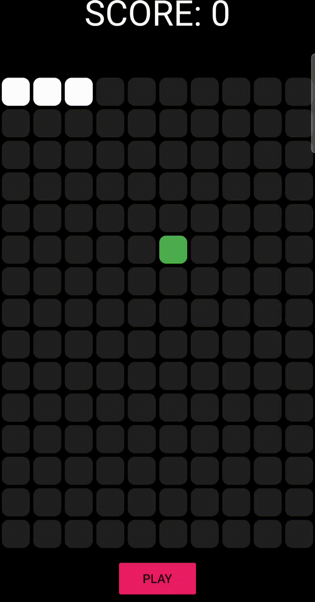

# 🐍 Snake Game Mobile

Um jogo clássico da cobrinha desenvolvido em Flutter para dispositivos móveis.

## 📱 Sobre o Projeto

Este projeto recria o tradicional jogo Snake, onde o jogador controla uma cobra que cresce ao consumir alimentos espalhados pelo mapa. O objetivo é alcançar a maior pontuação possível sem colidir com o próprio corpo.

O projeto foi desenvolvido para praticar conceitos de desenvolvimento mobile e lógica de jogos utilizando Flutter.

---

## ✨ Funcionalidades

- Controle da cobra por gestos de deslize
- Sistema de pontuação
- Crescimento progressivo da cobra
- Detecção de colisões
- Interface otimizada para dispositivos móveis

---

## 🛠️ Tecnologias Utilizadas

- Flutter
- Dart

---

## 📸 Demosntação

### Gameplay



---

## 🚀 Como Executar

### Pré-requisitos

- Flutter SDK instalado
- Android Studio ou VS Code
- Emulador Android/iOS ou dispositivo físico

### Instalação

```bash
git clone https://github.com/Vitornunees38/snake.git
cd snake

flutter pub get
flutter run
```

---

## 👨‍💻 Autor

Vitor Nunes

- GitHub: github.com/Vitornunees38
